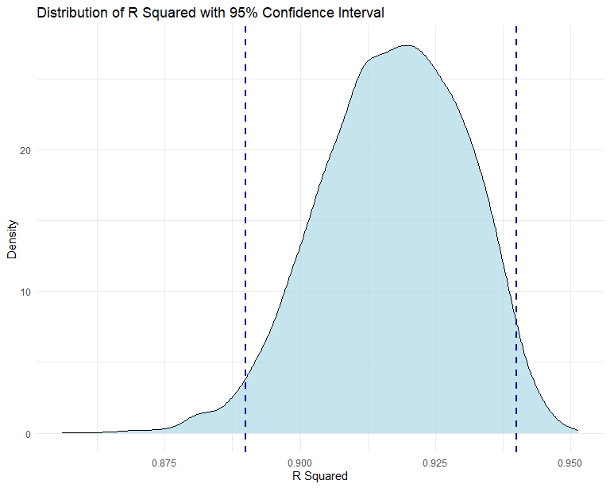
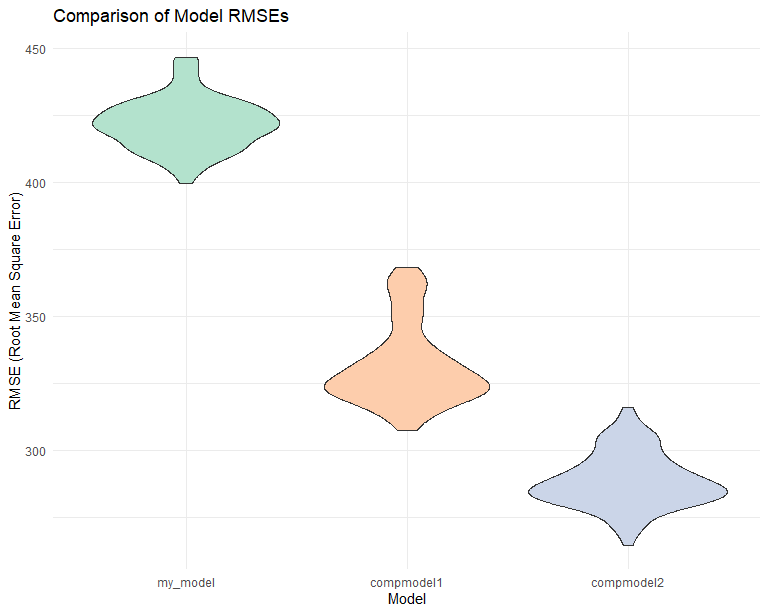

p8105_hw6_yw4251
================
You Wu
2023-12-02

# Problem 0

Load Necessary Packages.

``` r
library(tidyverse)
```

    ## ── Attaching core tidyverse packages ──────────────────────── tidyverse 2.0.0 ──
    ## ✔ dplyr     1.1.3     ✔ readr     2.1.4
    ## ✔ forcats   1.0.0     ✔ stringr   1.5.0
    ## ✔ ggplot2   3.4.3     ✔ tibble    3.2.1
    ## ✔ lubridate 1.9.2     ✔ tidyr     1.3.0
    ## ✔ purrr     1.0.2     
    ## ── Conflicts ────────────────────────────────────────── tidyverse_conflicts() ──
    ## ✖ dplyr::filter() masks stats::filter()
    ## ✖ dplyr::lag()    masks stats::lag()
    ## ℹ Use the conflicted package (<http://conflicted.r-lib.org/>) to force all conflicts to become errors

``` r
library(purrr)
library(ggridges)
library(modelr)
knitr::opts_chunk$set(
  fig.width = 8,
  fig.asp = .8,
  out.width = "90%"
)
```

# Problem 2

Load the dataset.

``` r
weather_df = 
  rnoaa::meteo_pull_monitors(
    c("USW00094728"),
    var = c("PRCP", "TMIN", "TMAX"), 
    date_min = "2022-01-01",
    date_max = "2022-12-31") |>
  mutate(
    name = recode(id, USW00094728 = "CentralPark_NY"),
    tmin = tmin / 10,
    tmax = tmax / 10) |>
  select(name, id, everything())
```

    ## using cached file: C:\Users\ariaw\AppData\Local/R/cache/R/rnoaa/noaa_ghcnd/USW00094728.dly

    ## date created (size, mb): 2023-09-30 22:29:29.66942 (8.542)

    ## file min/max dates: 1869-01-01 / 2023-09-30

``` r
weather_df
```

    ## # A tibble: 365 × 6
    ##    name           id          date        prcp  tmax  tmin
    ##    <chr>          <chr>       <date>     <dbl> <dbl> <dbl>
    ##  1 CentralPark_NY USW00094728 2022-01-01   201  13.3  10  
    ##  2 CentralPark_NY USW00094728 2022-01-02    10  15     2.8
    ##  3 CentralPark_NY USW00094728 2022-01-03     0   2.8  -5.5
    ##  4 CentralPark_NY USW00094728 2022-01-04     0   1.1  -7.1
    ##  5 CentralPark_NY USW00094728 2022-01-05    58   8.3  -0.5
    ##  6 CentralPark_NY USW00094728 2022-01-06     0   5     1.1
    ##  7 CentralPark_NY USW00094728 2022-01-07    97   1.1  -3.8
    ##  8 CentralPark_NY USW00094728 2022-01-08     0  -1    -6.6
    ##  9 CentralPark_NY USW00094728 2022-01-09    25   4.4  -1.6
    ## 10 CentralPark_NY USW00094728 2022-01-10     0   4.4  -4.3
    ## # ℹ 355 more rows

Finish the bootstrap.

``` r
bootstrap_analysis=
  weather_df|>
  bootstrap(n = 5000)|>
  mutate(
    models = map(strap, \(df) lm(tmax ~ tmin + prcp,data=df)),
    result = map(models, broom::tidy),
    log_beta_product=map(result, ~log(.x$estimate[2] * .x$estimate[3])),
    r.squared=map(models, ~broom::glance(.x)$r.squared)
    )|>
  select(-result)|>
  unnest(c(log_beta_product, r.squared))
```

    ## Warning: There were 3402 warnings in `mutate()`.
    ## The first warning was:
    ## ℹ In argument: `log_beta_product = map(result, ~log(.x$estimate[2] *
    ##   .x$estimate[3]))`.
    ## Caused by warning in `log()`:
    ## ! NaNs produced
    ## ℹ Run `dplyr::last_dplyr_warnings()` to see the 3401 remaining warnings.

``` r
bootstrap_analysis
```

    ## # A tibble: 5,000 × 5
    ##    strap                .id   models log_beta_product r.squared
    ##    <list>               <chr> <list>            <dbl>     <dbl>
    ##  1 <resample [365 x 6]> 0001  <lm>             NaN        0.913
    ##  2 <resample [365 x 6]> 0002  <lm>             NaN        0.916
    ##  3 <resample [365 x 6]> 0003  <lm>              -6.12     0.893
    ##  4 <resample [365 x 6]> 0004  <lm>             NaN        0.906
    ##  5 <resample [365 x 6]> 0005  <lm>             NaN        0.908
    ##  6 <resample [365 x 6]> 0006  <lm>             NaN        0.923
    ##  7 <resample [365 x 6]> 0007  <lm>              -7.39     0.926
    ##  8 <resample [365 x 6]> 0008  <lm>             NaN        0.917
    ##  9 <resample [365 x 6]> 0009  <lm>              -6.25     0.924
    ## 10 <resample [365 x 6]> 0010  <lm>             NaN        0.913
    ## # ℹ 4,990 more rows

Estimate of R^2.

``` r
quantiles=quantile(bootstrap_analysis$r.squared,c(0.025, 0.975))
quantiles
```

    ##      2.5%     97.5% 
    ## 0.8889831 0.9403622

``` r
ggplot(bootstrap_analysis,aes(r.squared))+
  geom_density(fill = "#ADD8E6", alpha = 0.7)+
  geom_vline(xintercept = quantiles[1], linetype = "dashed", color = "#00008B", size = 1) +
  geom_vline(xintercept = quantiles[2], linetype = "dashed", color = "#00008B", size = 1) +
  labs(
    title = "Distribution of R Squared with 95% Confidence Interval",
    x = "R Squared",
    y = "Density"
  )+
  theme_minimal()
```

    ## Warning: Using `size` aesthetic for lines was deprecated in ggplot2 3.4.0.
    ## ℹ Please use `linewidth` instead.
    ## This warning is displayed once every 8 hours.
    ## Call `lifecycle::last_lifecycle_warnings()` to see where this warning was
    ## generated.



Estimate of log(β̂1 \* β̂2).By calculation, 0.6804 portion of log(β̂1 \*
β̂2) are NA, in which case product of β̂1 and β̂2 are less than 0 (β̂2
mainly).

``` r
quantiles=quantile(bootstrap_analysis$log_beta_product,c(0.025, 0.975),na.rm=TRUE)
quantiles
```

    ##      2.5%     97.5% 
    ## -9.420680 -4.588049

``` r
ggplot(bootstrap_analysis,aes(log_beta_product))+
  geom_density(fill = "#ADD8E6", alpha = 0.7)+
  geom_vline(xintercept = quantiles[1], linetype = "dashed", color = "#00008B", size = 1) +
  geom_vline(xintercept = quantiles[2], linetype = "dashed", color = "#00008B", size = 1) +
  labs(
    title = "Distribution of log(β̂1 * β̂2) with 95% Confidence Interval",
    x = "log(β̂1 * β̂2)",
    y = "Density"
    )+
  theme_minimal()
```

    ## Warning: Removed 3402 rows containing non-finite values (`stat_density()`).


# Problem 3

Load and tidy the dataset.

``` r
bw=read_csv("data/birthweight.csv")|>
  janitor::clean_names()|>
  mutate(babysex=as.factor(babysex),
         frace=as.factor(frace),
         malform=as.factor(malform),
         mrace=as.factor(mrace))
```

    ## Rows: 4342 Columns: 20
    ## ── Column specification ────────────────────────────────────────────────────────
    ## Delimiter: ","
    ## dbl (20): babysex, bhead, blength, bwt, delwt, fincome, frace, gaweeks, malf...
    ## 
    ## ℹ Use `spec()` to retrieve the full column specification for this data.
    ## ℹ Specify the column types or set `show_col_types = FALSE` to quiet this message.

``` r
anyNA(bw)
```

    ## [1] FALSE

``` r
bw
```

    ## # A tibble: 4,342 × 20
    ##    babysex bhead blength   bwt delwt fincome frace gaweeks malform menarche
    ##    <fct>   <dbl>   <dbl> <dbl> <dbl>   <dbl> <fct>   <dbl> <fct>      <dbl>
    ##  1 2          34      51  3629   177      35 1        39.9 0             13
    ##  2 1          34      48  3062   156      65 2        25.9 0             14
    ##  3 2          36      50  3345   148      85 1        39.9 0             12
    ##  4 1          34      52  3062   157      55 1        40   0             14
    ##  5 2          34      52  3374   156       5 1        41.6 0             13
    ##  6 1          33      52  3374   129      55 1        40.7 0             12
    ##  7 2          33      46  2523   126      96 2        40.3 0             14
    ##  8 2          33      49  2778   140       5 1        37.4 0             12
    ##  9 1          36      52  3515   146      85 1        40.3 0             11
    ## 10 1          33      50  3459   169      75 2        40.7 0             12
    ## # ℹ 4,332 more rows
    ## # ℹ 10 more variables: mheight <dbl>, momage <dbl>, mrace <fct>, parity <dbl>,
    ## #   pnumlbw <dbl>, pnumsga <dbl>, ppbmi <dbl>, ppwt <dbl>, smoken <dbl>,
    ## #   wtgain <dbl>

The dataset contains 4342 observations across 20 variables with no
missing values. In the investigation, i want to investigate the impact
of several key factors on the weight of a newborn, as measured in grams
(bwt): the sex of the baby, the weight of the mother at the time of
delivery in pounds, the family’s monthly income, the gestational age in
weeks, the presence or absence of malformations, the age of the mother
at the time of delivery, the races of the mother and father, the average
number of cigarettes the mother smoked daily during pregnancy, and the
weight gained by the mother during pregnancy in pounds. My investigation
aims to elucidate how these variables collectively influence the birth
weight of a child. This approach aligns with established research
`Factors Affecting Birth Weight of a Newborn – A Community Based Study in Rural Karnataka, India`
\[<https://www.ncbi.nlm.nih.gov/pmc/articles/PMC3390317/>\]. (Metgud et
al., 2012)

``` r
fit=lm(bwt~babysex+delwt+fincome+gaweeks+malform+momage+mrace+frace+smoken+wtgain,data=bw)
fit|>
  summary()
```

    ## 
    ## Call:
    ## lm(formula = bwt ~ babysex + delwt + fincome + gaweeks + malform + 
    ##     momage + mrace + frace + smoken + wtgain, data = bw)
    ## 
    ## Residuals:
    ##      Min       1Q   Median       3Q      Max 
    ## -1694.77  -253.07     7.72   270.35  1540.55 
    ## 
    ## Coefficients:
    ##              Estimate Std. Error t value Pr(>|t|)    
    ## (Intercept)  419.6784    95.3148   4.403 1.09e-05 ***
    ## babysex2     -86.1347    12.8324  -6.712 2.16e-11 ***
    ## delwt          4.8062     0.3262  14.736  < 2e-16 ***
    ## fincome        0.3625     0.2761   1.313   0.1892    
    ## gaweeks       52.8274     2.0984  25.175  < 2e-16 ***
    ## malform1     -47.4860   109.1892  -0.435   0.6637    
    ## momage         0.4506     1.8498   0.244   0.8076    
    ## mrace2      -169.8830    71.1964  -2.386   0.0171 *  
    ## mrace3       -38.7588   111.1509  -0.349   0.7273    
    ## mrace4       -48.0343    69.5759  -0.690   0.4900    
    ## frace2      -117.8697    71.2985  -1.653   0.0984 .  
    ## frace3       -46.7950   107.1439  -0.437   0.6623    
    ## frace4       -92.3418    69.0371  -1.338   0.1811    
    ## frace8       -22.0401   114.4987  -0.192   0.8474    
    ## smoken       -11.8459     0.8963 -13.217  < 2e-16 ***
    ## wtgain         5.1539     0.6589   7.822 6.47e-15 ***
    ## ---
    ## Signif. codes:  0 '***' 0.001 '**' 0.01 '*' 0.05 '.' 0.1 ' ' 1
    ## 
    ## Residual standard error: 421.4 on 4326 degrees of freedom
    ## Multiple R-squared:  0.3254, Adjusted R-squared:  0.323 
    ## F-statistic: 139.1 on 15 and 4326 DF,  p-value: < 2.2e-16

## Key Findings from the Regression Model:

**Non-Significant Predictors**: the family’s monthly income (fincome),
the races of the mother and father, the age of the mother at the time of
delivery(momage). **Significant Predictors**: baby’s sex (babysex),
delivery weight (delwt), gestational weeks (gaweeks), mother’s race
(mrace2), and smoking status (smoken).

The model explains approximately 32.54% of the variability in
birthweight (adjusted R-squared: 0.323) and is statistically significant
(F-statistic: 139.1, p-value: \< 2.2e-16). The significant predictors
show both positive and negative relationships with birthweight. For
example, baby’s sex and smoking status negatively influence birthweight,
while delivery weight, gestational weeks, and weight gain during
pregnancy positively affect it.

``` r
bw|>
  modelr::add_residuals(fit,var = "pred") |>
  modelr::add_predictions(fit,var = "resid") |>
  ggplot(aes(x=pred,y=resid))+
  geom_point(color="#6C71C4",alpha=0.5)+
  geom_smooth(se = F, color = "red", method = "lm")+
  labs(x = "Fitted Values", y = "Residuals", title = "Residuals vs. Fitted Values")+
  theme_minimal()
```

    ## `geom_smooth()` using formula = 'y ~ x'


Modify my model by emitting non-significant variables and fit other two
models.

``` r
my_model=lm(bwt~babysex+delwt+gaweeks+malform+mrace+smoken+wtgain,data=bw)
compmodel1=lm(bwt ~ gaweeks + blength, data = bw)
compmodel2= lm(bwt ~ bhead + blength + babysex + bhead * blength + bhead * babysex + blength * babysex + bhead * blength * babysex, data = bw)
```

Make comparison in terms of the cross-validated prediction error

``` r
cv_df=
  crossv_mc(bw,100)|>
   mutate(
    train = map(train, as_tibble),
    test = map(test, as_tibble))

cv_df=
  cv_df|>
  mutate(
    my_model  = map(train,~lm(bwt~babysex+delwt+gaweeks+malform+mrace+smoken+wtgain, data = .x)),
    compmodel1  = map(train, ~lm(bwt ~ gaweeks + blength, data = .x)),
    compmodel2  = map(train, ~lm(bwt ~ bhead + blength + babysex + bhead * blength + bhead * babysex + blength * babysex + bhead * blength * babysex, data = .x)))|>
  mutate(
    rmse_my_model = map2_dbl(my_model, test, ~rmse(model = .x,data = .y)),
    rmse_compmodel1 = map2_dbl(compmodel1, test, ~rmse(model = .x,data = .y)),
    rmse_compmodel2 = map2_dbl(compmodel2, test, ~rmse(model = .x,data = .y)))
```

Make violin Plot.

``` r
cv_df |> 
  select(starts_with("rmse")) |> 
  pivot_longer(
    everything(),
    names_to = "model", 
    values_to = "rmse",
    names_prefix = "rmse_") |> 
  mutate(model = fct_inorder(model)) |> 
  ggplot(aes(x = model, y = rmse)) + geom_violin()
```


