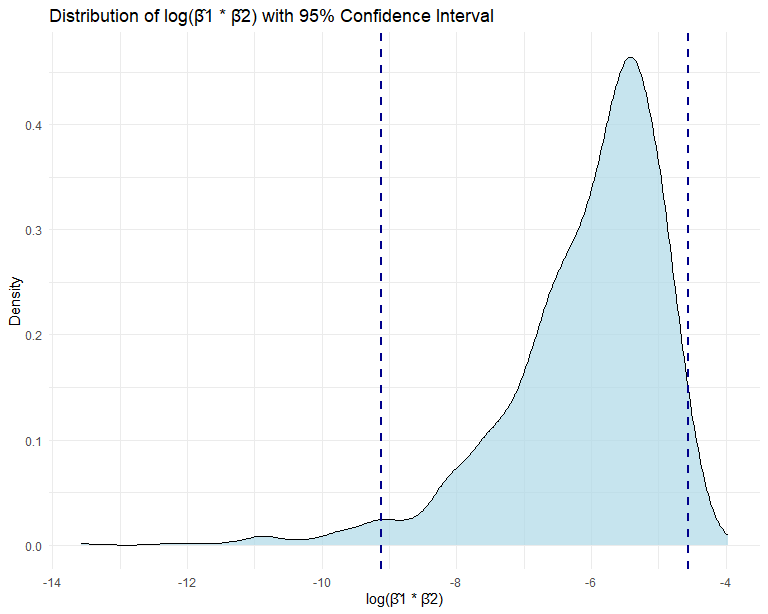

p8105_hw5_yw4251
================
You Wu
2023-11-12

# Problem 0

Load Necessary Packages.

``` r
library(tidyverse)
```

    ## ── Attaching core tidyverse packages ──────────────────────── tidyverse 2.0.0 ──
    ## ✔ dplyr     1.1.3     ✔ readr     2.1.4
    ## ✔ forcats   1.0.0     ✔ stringr   1.5.0
    ## ✔ ggplot2   3.4.3     ✔ tibble    3.2.1
    ## ✔ lubridate 1.9.2     ✔ tidyr     1.3.0
    ## ✔ purrr     1.0.2     
    ## ── Conflicts ────────────────────────────────────────── tidyverse_conflicts() ──
    ## ✖ dplyr::filter() masks stats::filter()
    ## ✖ dplyr::lag()    masks stats::lag()
    ## ℹ Use the conflicted package (<http://conflicted.r-lib.org/>) to force all conflicts to become errors

``` r
library(purrr)
library(ggridges)
knitr::opts_chunk$set(
  fig.width = 8,
  fig.asp = .8,
  out.width = "90%"
)
```

# Problem 2

Load the dataset.

``` r
weather_df = 
  rnoaa::meteo_pull_monitors(
    c("USW00094728"),
    var = c("PRCP", "TMIN", "TMAX"), 
    date_min = "2022-01-01",
    date_max = "2022-12-31") |>
  mutate(
    name = recode(id, USW00094728 = "CentralPark_NY"),
    tmin = tmin / 10,
    tmax = tmax / 10) |>
  select(name, id, everything())
```

    ## using cached file: C:\Users\ariaw\AppData\Local/R/cache/R/rnoaa/noaa_ghcnd/USW00094728.dly

    ## date created (size, mb): 2023-09-30 22:29:29.66942 (8.542)

    ## file min/max dates: 1869-01-01 / 2023-09-30

``` r
weather_df
```

    ## # A tibble: 365 × 6
    ##    name           id          date        prcp  tmax  tmin
    ##    <chr>          <chr>       <date>     <dbl> <dbl> <dbl>
    ##  1 CentralPark_NY USW00094728 2022-01-01   201  13.3  10  
    ##  2 CentralPark_NY USW00094728 2022-01-02    10  15     2.8
    ##  3 CentralPark_NY USW00094728 2022-01-03     0   2.8  -5.5
    ##  4 CentralPark_NY USW00094728 2022-01-04     0   1.1  -7.1
    ##  5 CentralPark_NY USW00094728 2022-01-05    58   8.3  -0.5
    ##  6 CentralPark_NY USW00094728 2022-01-06     0   5     1.1
    ##  7 CentralPark_NY USW00094728 2022-01-07    97   1.1  -3.8
    ##  8 CentralPark_NY USW00094728 2022-01-08     0  -1    -6.6
    ##  9 CentralPark_NY USW00094728 2022-01-09    25   4.4  -1.6
    ## 10 CentralPark_NY USW00094728 2022-01-10     0   4.4  -4.3
    ## # ℹ 355 more rows

Finish the bootstrap.

``` r
bootstrap_analysis=
  weather_df|>
  modelr::bootstrap(n = 5000)|>
  mutate(
    models = map(strap, \(df) lm(tmax ~ tmin + prcp,data=df)),
    result = map(models, broom::tidy),
    log_beta_product=map(result, ~log(.x$estimate[2] * .x$estimate[3])),
    r.squared=map(models, ~broom::glance(.x)$r.squared)
    )|>
  select(-result)|>
  unnest(c(log_beta_product, r.squared))
```

    ## Warning: There were 3339 warnings in `mutate()`.
    ## The first warning was:
    ## ℹ In argument: `log_beta_product = map(result, ~log(.x$estimate[2] *
    ##   .x$estimate[3]))`.
    ## Caused by warning in `log()`:
    ## ! NaNs produced
    ## ℹ Run `dplyr::last_dplyr_warnings()` to see the 3338 remaining warnings.

``` r
bootstrap_analysis
```

    ## # A tibble: 5,000 × 5
    ##    strap                .id   models log_beta_product r.squared
    ##    <list>               <chr> <list>            <dbl>     <dbl>
    ##  1 <resample [365 x 6]> 0001  <lm>                NaN     0.903
    ##  2 <resample [365 x 6]> 0002  <lm>                NaN     0.896
    ##  3 <resample [365 x 6]> 0003  <lm>                NaN     0.934
    ##  4 <resample [365 x 6]> 0004  <lm>                NaN     0.919
    ##  5 <resample [365 x 6]> 0005  <lm>                NaN     0.926
    ##  6 <resample [365 x 6]> 0006  <lm>                NaN     0.931
    ##  7 <resample [365 x 6]> 0007  <lm>                NaN     0.943
    ##  8 <resample [365 x 6]> 0008  <lm>                NaN     0.921
    ##  9 <resample [365 x 6]> 0009  <lm>                NaN     0.935
    ## 10 <resample [365 x 6]> 0010  <lm>                NaN     0.911
    ## # ℹ 4,990 more rows

Estimate of R^2.

``` r
quantile(bootstrap_analysis$r.squared,c(0.025, 0.975))
```

    ##      2.5%     97.5% 
    ## 0.8899231 0.9401700

``` r
ggplot(bootstrap_analysis,aes(r.squared))+
  geom_density()+
  labs(title = "Distribution of R Square")
```


0.6678 portion of them are NA.

``` r
quantile(bootstrap_analysis$log_beta_product,c(0.025, 0.975),na.rm=TRUE)
```

    ##      2.5%     97.5% 
    ## -8.787544 -4.558707

``` r
ggplot(bootstrap_analysis,aes(log_beta_product))+
  geom_density()+
  labs(title = "Distribution of ln(β̂1 * β̂2)")
```

    ## Warning: Removed 3339 rows containing non-finite values (`stat_density()`).



# Problem 3
